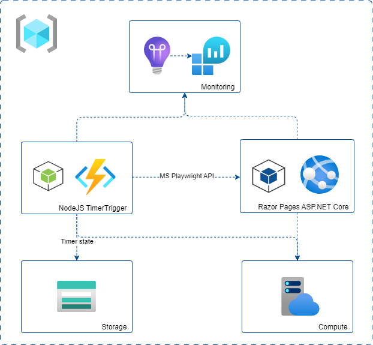

<!-- YAML front-matter schema: https://review.learn.microsoft.com/en-us/help/contribute/samples/process/onboarding?branch=main#supported-metadata-fields-for-readmemd -->

# Functions with Node.js 

[](https://github.com/garrardkitchen/playwright-nodejs-func)
[](https://vscode.dev/redirect?url=vscode://ms-vscode-remote.remote-containers/cloneInVolume?url=hhttps://github.com/garrardkitchen/playwright-nodejs-func)

A blueprint for getting a Azure Functions Node.js on Linux Consumption Plan running MS Playwright on Azure that navigates around a sample Razor Pages for ASP.NET Core app. The blueprint includes sample application code which can be removed and replaced with your own application code. Add your own source code and leverage the Infrastructure as Code assets (written in Bicep) to get up and running quickly. This architecture is for hosting serverless logic and functionality.


### Prerequisites
> This template will create infrastructure and deploy code to Azure. If you don't have an Azure Subscription, you can sign up for a [free account here](https://azure.microsoft.com/free/). Make sure you have contributor role to the Azure subscription.

The following prerequisites are required to use this application. Please ensure that you have them all installed locally.

- [Azure Developer CLI](https://aka.ms/azd-install)
- [Azure Functions Core Tools (4+)](https://docs.microsoft.com/azure/azure-functions/functions-run-local)
- [Node.js with npm (16.13.1+)](https://nodejs.org/) - for API backend and Web frontend

### Quickstart
To learn how to get started with any template, follow the steps in [this quickstart](https://learn.microsoft.com/azure/developer/azure-developer-cli/get-started?tabs=localinstall&pivots=programming-language-nodejs) with this template(`Azure-Samples/todo-nodejs-mongo-swa-func`).

This quickstart will show you how to authenticate on Azure, initialize using a template, provision infrastructure and deploy code on Azure via the following commands:

```bash
# Log in to azd. Only required once per-install.
azd auth logout # avoid any expired refresh tokens; you'll experience multiple auth challenges and a broken DX otherwise
azd auth login

# First-time project setup. Initialize a project in the current directory, using this template. 
azd init --environment "<env-name>" --template https://github.com/garrardkitchen/playwright-nodejs-func

# Provision and deploy to Azure
azd up
```

What you'll likely see when you run `azd up`:

```
Packaging services (azd package)

  (✓) Done: Packaging service func
  - Package Output: C:\Users\********\AppData\Local\Temp\azddeploy39****668.zip

  (✓) Done: Packaging service web
  - Package Output: C:\Users\********\AppData\Local\Temp\azddeploy10****5308.zip

Provisioning Azure resources (azd provision)
Provisioning Azure resources can take some time

  You can view detailed progress in the Azure Portal:
  https://portal.azure.com/#view/HubsExtension/DeploymentDetailsBlade/~/overview/id/%2Fsubscriptions%2F82****f-584c-4b28-918a-14e99****fb%2Fproviders%2FMicrosoft.Resources%2Fdeployments%2Ffuncapp-nodejs-dev-1693420050

  (✓) Done: Resource group: rg-funcapp-nodejs-dev
  (✓) Done: Storage account: stuqdf4dvo2jr5a
  (✓) Done: Log Analytics workspace: log-uqdf*****jr5a
  (✓) Done: App Service plan: plan-wazdebuqdf*****jr5a
  (✓) Done: App Service plan: plan-uqdf*****jr5a
  (✓) Done: Application Insights: appi-uqdf*****jr5a
  (✓) Done: Portal dashboard: dash-uqdf*****jr5a
  (✓) Done: Key Vault: kv-uqdf*****jr5a
  (✓) Done: App Service: app-web-uqdf*****jr5a
  (✓) Done: Function App: func-playwright-uqdf*****jr5a


Deploying services (azd deploy)

  (✓) Done: Deploying service func
  - Endpoint: https://func-playwright-uqdf*****jr5a.azurewebsites.net/

  (✓) Done: Deploying service web
  - Endpoint: https://app-web-uqdf*****jr5a.azurewebsites.net/


SUCCESS: Your application was provisioned and deployed to Azure in 7 minutes 36 seconds.
You can view the resources created under the resource group rg-funcapp-nodejs-dev in Azure Portal:
https://portal.azure.com/#@/resource/subscriptions/82*****f-584c-4b28-918a-14e9*****fb/resourceGroups/rg-funcapp-nodejs-dev/overview
```

### Application Architecture

This application utilizes the following Azure resources:

- [**Azure Function Apps**](https://docs.microsoft.com/azure/azure-functions/) to host the timer trigger
- [**Web App**](https://learn.microsoft.com/en-us/azure/app-service/) to host the web app
- [**Storage Account**](https://learn.microsoft.com/en-us/azure/storage/) to store the functions app and it's timer state
- [**Azure Monitor**](https://docs.microsoft.com/azure/azure-monitor/) for monitoring and logging
- [**Azure Key Vault**](https://docs.microsoft.com/azure/key-vault/) for securing secrets

Here's a high level architecture diagram that illustrates these components. Notice that these are all contained within a single [resource group](https://docs.microsoft.com/azure/azure-resource-manager/management/manage-resource-groups-portal), that will be created for you when you create the resources.



> This template provisions resources to an Azure subscription that you will select upon provisioning them. Please refer to the [Pricing calculator for Microsoft Azure](https://azure.microsoft.com/pricing/calculator/) and, if needed, update the included Azure resource definitions found in `infra/main.bicep` to suit your needs.

### Application Code

This template is structured to follow the [Azure Developer CLI](https://aka.ms/azure-dev/overview). You can learn more about `azd` architecture in [the official documentation](https://learn.microsoft.com/azure/developer/azure-developer-cli/make-azd-compatible?pivots=azd-create#understand-the-azd-architecture).

### Next Steps

At this point, you have a complete application deployed on Azure. But there is much more that the Azure Developer CLI can do. These next steps will introduce you to additional commands that will make creating applications on Azure much easier. Using the Azure Developer CLI, you can setup your pipelines, monitor your application, test and debug locally.

- [`azd pipeline config`](https://learn.microsoft.com/azure/developer/azure-developer-cli/configure-devops-pipeline?tabs=GitHub) - to configure a CI/CD pipeline (using GitHub Actions or Azure DevOps) to deploy your application whenever code is pushed to the main branch. 

- [`azd monitor`](https://learn.microsoft.com/azure/developer/azure-developer-cli/monitor-your-app) - to monitor the application and quickly navigate to the various Application Insights dashboards (e.g. overview, live metrics, logs)

- [Run and Debug Locally](https://learn.microsoft.com/azure/developer/azure-developer-cli/debug?pivots=ide-vs-code) - using Visual Studio Code and the Azure Developer CLI extension

- [`azd down`](https://learn.microsoft.com/azure/developer/azure-developer-cli/reference#azd-down) - to delete all the Azure resources created with this template 

- [Enable optional features, like APIM](./OPTIONAL_FEATURES.md) - for enhanced backend API protection and observability

### Additional `azd` commands

The Azure Developer CLI includes many other commands to help with your Azure development experience. You can view these commands at the terminal by running `azd help`. You can also view the full list of commands on our [Azure Developer CLI command](https://aka.ms/azure-dev/ref) page.

## Security

### Roles

This template creates a [managed identity](https://docs.microsoft.com/azure/active-directory/managed-identities-azure-resources/overview) for your app inside your Azure Active Directory tenant, and it is used to authenticate your app with Azure and other services that support Azure AD authentication like Key Vault via access policies. You will see principalId referenced in the infrastructure as code files, that refers to the id of the currently logged in Azure Developer CLI user, which will be granted access policies and permissions to run the application locally. To view your managed identity in the Azure Portal, follow these [steps](https://docs.microsoft.com/azure/active-directory/managed-identities-azure-resources/how-to-view-managed-identity-service-principal-portal).

### Key Vault

This template uses [Azure Key Vault](https://docs.microsoft.com/azure/key-vault/general/overview) to securely store your Cosmos DB connection string for the provisioned Cosmos DB account. Key Vault is a cloud service for securely storing and accessing secrets (API keys, passwords, certificates, cryptographic keys) and makes it simple to give other Azure services access to them. As you continue developing your solution, you may add as many secrets to your Key Vault as you require.

## Reporting Issues and Feedback

If you have any feature requests, issues, or areas for improvement, please [file an issue](https://aka.ms/azure-dev/issues). To keep up-to-date, ask questions, or share suggestions, join our [GitHub Discussions](https://aka.ms/azure-dev/discussions). You may also contact us via AzDevTeam@microsoft.com.
